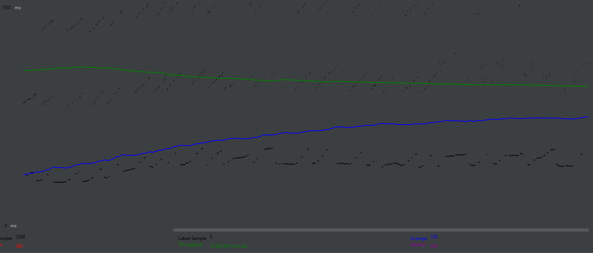
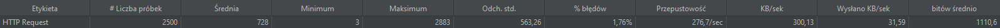
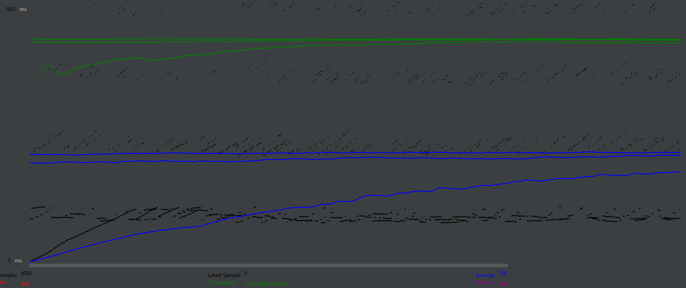
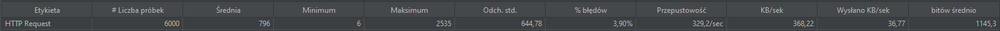
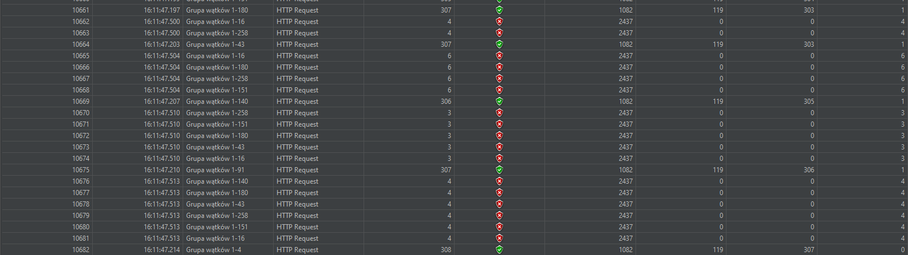
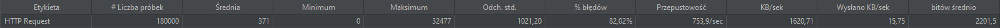

## Jmeter performance test for app written on python course

### App overview

An application that allow user to register an account login to it and register a place for an event to take place.
User also may look what places he got reserved and when i different tab

### Application performance in some cases:

#### Case 1 - OK behaviour:

Lest assume there was a boom on the application so that 250 users would get on website each second after 10 seconds the
number of users would get normalized at around 2500 users few users would get timeouts but overall the application would
continue to function with average waiting time of 728 ms

and connection success rate of 98.24%

For this kind of application this success rate is good and don't need to be enhanced in more important businesses even
when loss rate is smaller than 2% it could be destructive.

#### Case 2 - less OK behaviour:

According to case 1 our app was not so far from breaking lets see how it would preform on 300 users opening app
each second for 20 seconds this time. In a matter of 20 seconds we got 6000 users this time application had more
breakdowns and higher average waiting time this time it was 796 ms

and connection success rate of 96.10%

#### Case 3 - Not OK behaviour:

This time we got 300 new users every second for 10 minutes it sums up to 180000 users in total this time the average
waiting time is 371 ms but that doesn't mean everything is fine the app just didn't allow any users get to it 
after around 10000 users were on site so it's after around of 30 seconds of app working

connection success rate in this case is only 17.98% which is totally unacceptable no matter what application you made

### Summary

Jmeter is good to find border cases for when your app is about to no longer work based on user traffic but to preform 
those tests to be valid you should know approximately how many users/traffic you are expecting on your site to test it 
and prevent any serious hacker attacks that want to kill your app